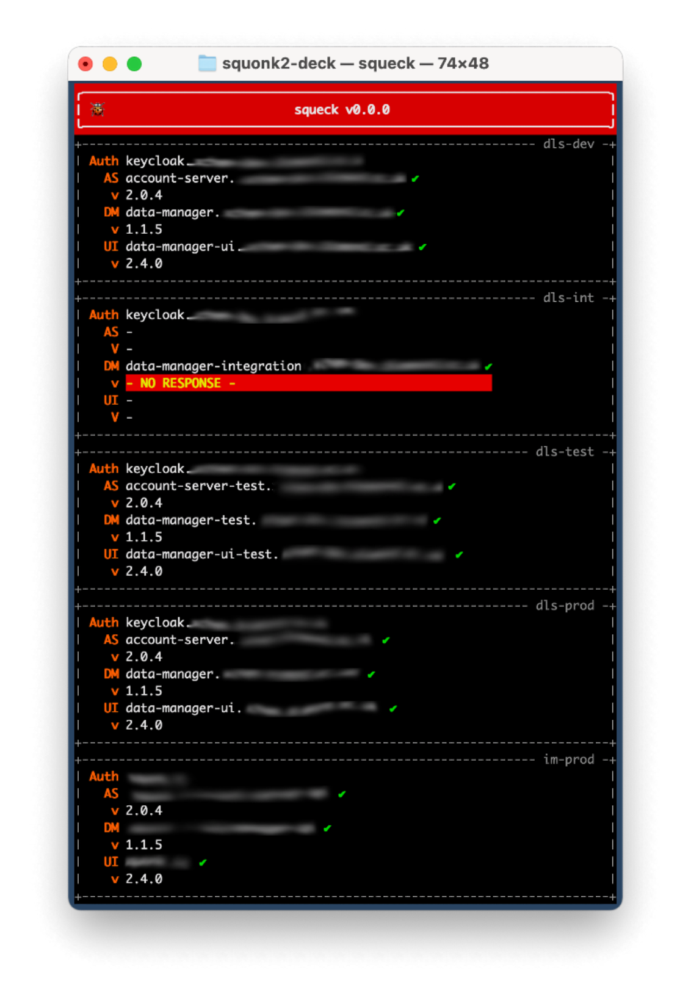

############
Squonk2 Deck
############

**Squeck** (Squonk2 Deck) is s Textual-UI (TUI) for the
visualisation of Squonk2 environments.

**Squeck** uses the `squonk2-python-client`_ to interact with a Squonk2 environment
and uses Will McGugan's `textual`_ framework to provide the user with a simple,
text-based user interface modelled on the popular `k9s`_ Kubernetes monitor.

.. _k9s: https://k9scli.io
.. _squonk2-python-client: https://github.com/InformaticsMatters/squonk2-python-client

************
Installation
************

**Squeck** is a Python application, written with Python 3.10 and published
to `PyPI`_ and is easily installed using ``pip``::

    pip install im-squonk2-deck

.. _pypi: https://pypi.org/project/im-squonk2-deck/

*********
Execution
*********

Before running **Squeck** you must have access to a Squonk2 environment.
**Squeck** obtains details of the environment through a YAML-based
*environments* file. An example file, ``environments``, is located in the root
of this project:

    .. include:: environments
       :code: yaml

When **Squeck** starts it will look for the environments file in your home
directory, in the file ``~/.squonk2/environments``. If you place your populated
environments file there you need do nothing else prior to running **Squeck**.
If you prefer to put your ``environments`` file elsewhere, or have multiple
files, set the path to your file using the environment variable
``SQUONK2_ENVIRONMENTS_FILE``::

    export SQUONK2_ENVIRONMENTS_FILE=~/my-squonk2-environments

With an environments file in place you can run **Squeck**::

    squeck

Logging
-------

You can enable logging from **Squeck** and the underlying textual framework by
setting the environment variable ``SQUONK2_LOGFILE`` when running the
application::

    SQUONK2_LOGFILE=./squeck.log squeck

Debugging
---------

`Textual`_ doesn't like anything being written to the console so printing
(even to ``stderr``) will topple the display. That's why ``stderr`` is
diverted when the application is running and nothing is printed.
There comes a time, though, when you need to see the error log.
For these times you can run **Squeck** without stderr diverted::

    squeck --enable-stderr
